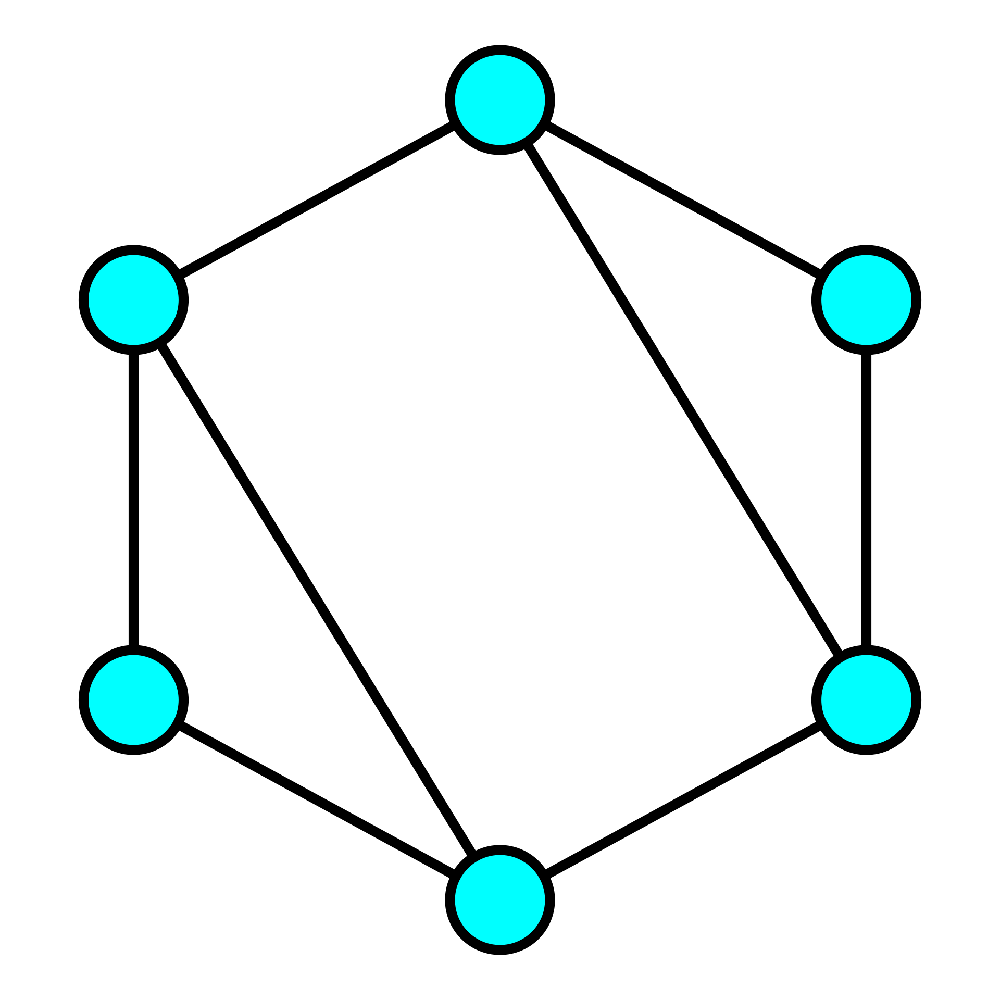

# Connected

_Connected_ aims to be useful for overlaying and solving both directed and undirected graphs. The goal is to provide generic mixins to add a solver to real code, rather than an academic demonstration of how Dijkstra's algorithm works.

## Installation

Add this line to your application's Gemfile:

```ruby
gem 'connected'
```

And then execute:

    $ bundle install

Or install it yourself as:

    $ gem install connected

## Usage

### Simple Uses

For a simpler use-cases, the classes `Connected::GenericNode`, `Connected::GenericConnection`, and `Connected::Path` will suffice. These can either be subclassed or extended to wrap any real work. First, I'll just demonstrate how they work with an undirected graph (meaning a set of bidirectional connections):

```ruby
require 'connected'

include Connected

# First, let's make some nodes
node_a = GenericNode.new('a')
node_b = GenericNode.new('b')
node_c = GenericNode.new('c')
node_d = GenericNode.new('d')

# Now we can create connections between some of them
node_a.connects_to node_b, metric: 1
node_a.connects_to node_c, metric: 10
node_b.connects_to node_c, metric: 3
node_b.connects_to node_d, metric: 2, state: :closed
node_c.connects_to node_d, metric: 3
```

The above represents a graph like this in code:

```text
(a)_(b) _ _ _ _ (d)
 \____\___(c)___/
```

Based on this, the fastest (lowest cost) route from node "a" to node "d" should be "a" to "b" to "c" to "d" with a total cost of `7`. Let's find that in code:

```ruby
path = Path.find(from: node_a, to: node_d)
path.to_s
# => "a -> b -> c -> d"
path.cost
# => 7
```

We can also find paths based on least hops rather than lowest metric cost by first getting all "reasonable" routes (meaning as it finds candidates, it rejects those that have too many hops or too high of a metric):

```ruby
candidate_paths = Path.all(from: node_a, to: node_d)
candidate_paths.size
# => 2
candidate_paths.min_by(&:hops).to_s
# => "a -> c -> d"
```

We can simulate or ignore when paths are closed as well:

```ruby
path = Path.find(from: node_a, to: node_d, include_closed: true)
path.to_s
# => "a -> b -> d"
path.cost
# => 3
```

This behavior of excluding suboptimal routes from `Path.all()` might be confusing if you're really looking for **every** possible route. In this case, you can add `suboptimal: true` and it'll really give you every possible route, sorted from lowest to highest cost.

```ruby
every_path = Path.all(from: node_a, to: node_d, suboptimal: true)
every_path.size
# => 2
every_path_even_closed = Path.all(
    from: node_a,
    to: node_d,
    suboptimal: true,
    include_closed: true
)
every_path_even_closed.size
# => 4
every_path_even_closed.map(&:to_s)
# => ["a -> b -> d", "a -> b -> c -> d", "a -> c -> d", "a -> c -> b -> d"]
```

It is possible to manipulate connections after they've been defined. To retrieve the `GenericConnection` object, use `#connection_to` on the source node:

```ruby
connection = node_b.connection_to(node_d)
connection.state
# => :closed
connection.metric
# => 2
connection.state = :open

# Now we can see that our previous simulation is right
Path.find(from: node_a, to: node_d).to_s
# => "a -> b -> d"
```

All the above examples are based on connections created using `node.connects_to other_node`, which creates a bi-directional connection. For representing _directed_ graph, you can add `directed: true` to the method which causes it to only create the connection you explicitly described (meaning it won't create the connection back for you).

### Overlaying on Other Objects

Nearly all the above capabilities are available via modules that can be mixed into your own objects. Just like adding `include Comparable` to your own code requires the `<=>` method be defined on your Object, mixing in the Connected modules require a few methods be available on instances.

Mixing in `Connected::Vertex` into your node-like classes requires the `#connections` method be implemented (either directly or as a readable attribute). This method is used to find all connections/`Edge` objects associated with (i.e., with the `from` set to) the object in question. No sorting is necessary; it just needs to provide an Array (or Array-like collection) of instances with `Connected::Edge` mixed in. These connections don't even need to exist outside of the `#connections` method call; they can be constructed and yielded on demand.

Connections between Vertices (called _edges_) mix in the `Connected::Edge` module and require `#from` and `#to` be implemented. In most cases, you'll also want to implement `#metric` (otherwise it'll always be `1`) and either `#state` (otherwise it'll always be `:open`) or both `#open?` and `#closed?`. The default implementations of `#open?` and `#closed?` check if `#state` is `:open` or `:closed`, respectively.

Let's build a simple example network and implement a lightweight version of [OSPF](https://en.wikipedia.org/wiki/Open_Shortest_Path_First) (we won't actually implement the _protocol_, just the concept of finding the shortest open path). This is going to be a decent chunk of code, but it is worth reading over. First, let's build our classes:

```ruby
require 'connected'

class Subnet
  attr_reader :links

  def initialize(block:)
    @block = block # needs to be in CIDR notation <= /24
    @links = [] # Here we'll store all the links to this subnet
  end

  def size
    bits = 32 - @block.split('/').last.to_i
    2**bits
  end

  def first_three
    @block.split('.').first(3).join('.')
  end

  def assign_ip(link, ip: nil)
    all_ips = (1..(size - 2)).to_a.map { |ip| [first_three, ip].join('.') }
    used_ips = @links.map(&:ip)

    new_ip = if ip
              raise 'Invalid IP' unless all_ips.include?(ip)

              raise 'Duplicate IP' if used_ips.include?(ip)

              ip
            else
              (all_ips - used_ips).sample # picks a random available IP
            end

    @links << link unless @links.include?(link)

    new_ip
  end
end

class Link
  attr_reader :device, :subnet
  attr_accessor :speed, :state

  def initialize(device:, subnet:, speed: 1000, state: :up)
    @device = device
    @subnet = subnet
    @speed = speed
    @state = state
    @ip = nil
  end

  def ip
    @ip ||= subnet.assign_ip(self)
  end

  def ip=(value)
    return true if @ip == value

    subnet.assign_ip(self, ip: value) # will raise an error if duplicate
    @ip = value
  end
end

class Router
  include Connected::Vertex

  attr_reader :name, :links

  def initialize(name:)
    @name = name
    @links = []
  end

  def add_link(subnet, ip: nil, speed: 1000, state: :up)
    return false if subnets.include?(subnet) # only one connection per subnet

    link = Link.new(device: self, subnet: subnet, speed: speed, state: state)
    if ip
      link.ip = ip
    else
      link.ip # let the link request its own IP
    end

    @links << link
    link
  end

  def subnets
    links.map(&:subnet)
  end

  def ips
    links.map(&:ip)
  end

  # Here's the method required by Connected
  def connections
    # Dynamically build a collection of Adjacencies
    links.map do |link|
      link.subnet.links.reject { |l| l == link }.map do |other_link|
        Adjacency.new(from: self, to: other_link.device, links: [link, other_link])
      end
    end.flatten
  end
end

class Adjacency
  include Connected::Edge

  attr_reader :from, :to

  def initialize(from:, to:, links:)
    @from = from
    @to = to
    @links = links
  end

  def state
    # either both up or the adjacency is "closed"
    @links.map(&:state).uniq == [:up] ? :open : :closed
  end

  # Lower metrics are better, so take the lowest speed connection and
  #   use the inverse
  def metric
    1.0 / @links.map(&:speed).min
  end
end

class Route < Connected::Path
end
```

Now we can setup some routers and attach them to some subnets (and let our fake DHCP assign them IPs):

```ruby
sub1 = Subnet.new(block: '192.168.1.0/24')
sub2 = Subnet.new(block: '192.168.2.0/24')
sub3 = Subnet.new(block: '192.168.3.0/27')

bob = Router.new(name: 'Bob')
alice = Router.new(name: 'Alice')
joe = Router.new(name: 'Joe')
jim = Router.new(name: 'Jim')
lonely = Router.new(name: 'Lonely')

bob.add_link(sub1)
bob.add_link(sub3, speed: 100)
alice.add_link(sub1)
alice.add_link(sub2)
joe.add_link(sub2)
joe.add_link(sub3)
jim.add_link(sub1, speed: 10_000)
jim.add_link(sub3, speed: 10_000)
lonely.add_link(sub3, speed: 5_000)

bob.ips
# => ["192.168.1.25", "192.168.3.8"]
alice.ips
# => ["192.168.1.155", "192.168.2.11"]
joe.ips
# => ["192.168.2.123", "192.168.3.17"]
jim.ips
# => ["192.168.1.174", "192.168.3.6"]
lonely.ips
# => ["192.168.3.2"]

# Bob has a direct connection to everyone
bob.neighbors
# => ["Alice", "Jim", "Joe", "Lonely"]

# Alice can't _directly_ connect to Lonely
alice.neighbors.map(&:name)
# => ["Bob", "Jim", "Joe"]
```

Now let's take a look at how routing looks:

```ruby
# Even though Bob is directly connected to subnet 3 (where Lonely is),
# it is faster to get there through Jim
Route.find(from: bob, to: lonely).to_s
# => "Bob -> Jim -> Lonely"

# Bob uses his direct connection to talk to Alice
Route.find(from: bob, to: alice).to_s
# => "Bob -> Alice"

# Alice also goes through Jim to get to Lonely
Route.find(from: alice, to: lonely).to_s
# => "Alice -> Jim -> Lonely"
```

That all works! Links themselves (and their states) were memoized but the adjacencies were constructed and used dynamically. Notice that while there was a fair amout of setup/code there, very little was associated with comparing connections and the `Route` class is entirely empty!

## Development

After checking out the repo, run `bin/setup` to install dependencies. Then, run `rake spec` to run the tests. You can also run `bin/console` for an interactive prompt that will allow you to experiment.

To install this gem onto your local machine, run `bundle exec rake install`. To release a new version, update the version number in `version.rb`, and then run `bundle exec rake release`, which will create a git tag for the version, push git commits and tags, and push the `.gem` file to [rubygems.org](https://rubygems.org).

## Contributing

Bug reports and pull requests are welcome on GitHub at https://github.com/jgnagy/connected.

## License

The gem is available as open source under the terms of the [MIT License](https://opensource.org/licenses/MIT).
